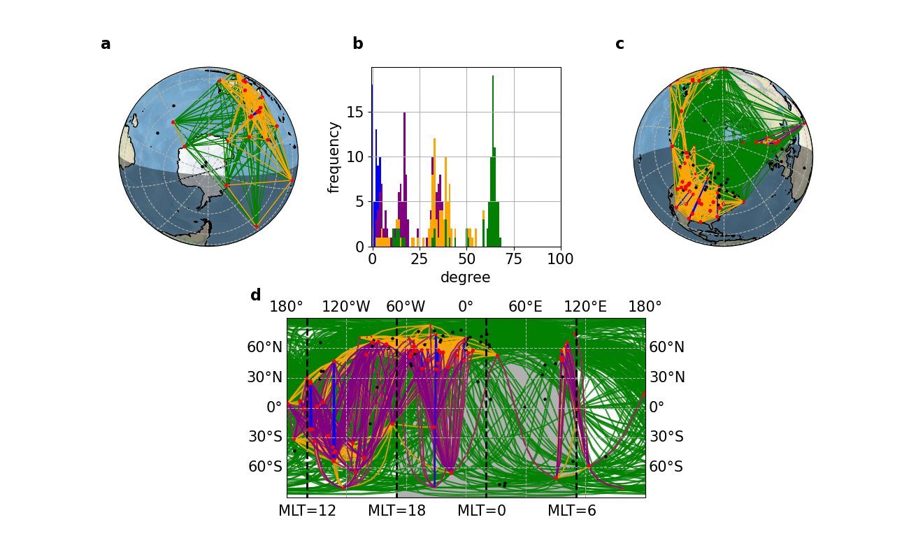

# Characterising Extreme Space Weather Events Using Unsupervised Machine Learning: A Dynamical Network Approach

Network analysis of ULF geomagnetic pulsations (Pc1-Pc5) using ground magnetometer data from [SuperMAG](https://supermag.jhuapl.edu/).

## Motivation

Extreme space weather events pose a significant risk to modern infrastructure, with potential economic impacts estimated in the trillions of dollars. Geomagnetically induced currents (GICs) can damage power grids, disrupt satellite operations, degrade GPS accuracy, and compromise communications systems. Understanding and characterising these events is critical for forecasting and mitigation.

This project uses **spatiotemporal pattern analysis** to characterise extreme space weather events by studying how ULF (ultra-low frequency) geomagnetic pulsations propagate across networks of ground-based magnetometer stations. By identifying coherent oscillation patterns, community structures, and temporal evolution in station networks, we can better understand the large-scale dynamics of geomagnetic disturbances and work towards improved early warning systems.

<p align="center">
  
</p>

**Published paper:** [Global Dynamical Network of the Spatially Correlated Pc2 Wave Response for the 2015 St. Patrick's Day Storm](https://doi.org/10.1029/2022JA031175) — *Journal of Geophysical Research: Space Physics*, 2023

## Signal Processing and Time Series Methods

This project applies advanced signal processing and time series analysis techniques to high-cadence (1-second) magnetometer data from 100+ globally distributed stations:

- **Butterworth bandpass filtering** — Isolation of Pc2 wave activity (0.1–0.2 Hz) from broadband magnetometer signals using 4th-order IIR filters, separating geophysical signals of interest from instrument noise and other frequency bands
- **Windowed cross-correlation** — Sliding-window normalised time-lagged cross-correlation between all station pairs (100s windows, 50% overlap), quantifying both coherence amplitude and propagation lag at sub-second precision
- **Surrogate statistical testing** — Phase-randomised surrogate time series to establish null distributions and determine statistical significance of cross-correlations, rejecting spurious connections arising from bandpass-filtered coloured noise
- **Signal-to-noise estimation** — Surrogate-estimated SNR (ratio of real network connections to surrogate connections) used to identify intervals of genuine coherent wave activity above the noise floor
- **Peak detection and phase classification** — Extraction of cross-correlation extrema near zero lag to classify connections as in-phase, anti-phase, or directed (lagged), enabling decomposition into physically distinct sub-networks
- **Multi-variate time series decomposition** — Independent analysis of three orthogonal magnetic field components (north, east, vertical) to resolve different polarisation modes and source mechanisms

These methods enable construction of dynamical functional networks from raw time series — an approach also applicable to EEG/MEG neuroscience data, seismological arrays, financial time series, and other multi-sensor correlation problems.

## Approach

We build time-evolving networks from cross-correlation analysis of geomagnetic pulsation signals across high-latitude magnetometer stations. Nodes represent stations; edges represent statistically significant coherence with associated time lags. The spatiotemporal structure of these networks reveals how energy propagates through the magnetosphere-ionosphere system during extreme events.

### Pipeline

```
SuperMAG CSV data (data/)
    -> Butterworth bandpass filter (signal_processing/)
    -> Windowed cross-correlation (cross_correlation/)
    -> Surrogate statistical testing (network_construction/)
    -> Build NetworkX graphs (network_construction/)
    -> Analyse: communities, degree distributions (network_analysis/)
    -> Visualise on geographic maps (visualisation/)
```

## Setup

```bash
pip install -r requirements.txt
```

## Usage

All scripts are run from the project root:

```bash
# Main network construction
python network_construction/networkx_pcmodel.py

# Parallel Pc power calculation
python network_construction/parallel_pc_power.py

# Network with surrogate testing
python network_construction/surrogate_pc_net.py

# Read and analyse results
python network_analysis/read_networks.py

# Geographic visualisation with communities
python visualisation/Drawnet_community.py
```

## Project Structure

```
├── signal_processing/       # Bandpass filtering, zero-crossing, SNR
├── cross_correlation/       # Windowed cross-correlation between station pairs
├── network_construction/    # Build NetworkX graphs from correlations
├── network_analysis/        # Read, analyse, and characterise networks
├── visualisation/           # Geographic plots, distributions, network drawing
├── notebooks/               # Jupyter notebooks for interactive exploration
├── data/                    # SuperMAG station metadata and event CSVs
├── plots/                   # Generated output plots
├── exploratory/             # Test and playground scripts
└── requirements.txt
```

## Data

Download magnetometer time-series from [SuperMAG](https://supermag.jhuapl.edu/) as CSV and place in `data/`. Station metadata is in `data/supermag-stations.csv`.

## Key Scripts

| Script | Purpose |
|--------|---------|
| `network_construction/networkx_pcmodel.py` | Main network construction pipeline |
| `network_construction/parallel_pc_power.py` | Parallel Pc power spectral analysis |
| `network_construction/surrogate_pc_net.py` | Network construction with surrogate validation |
| `visualisation/Drawnet_community.py` | Geographic network plot with community detection |
| `network_analysis/read_networks.py` | Network reading and property analysis |
| `network_analysis/NetDistr.py` | Network distribution analysis class |
| `signal_processing/ULF_bp.py` | ULF bandpass filtering |

## Author

Shahbaz Chaudhary ([@shahbaz22](https://github.com/shahbaz22))
